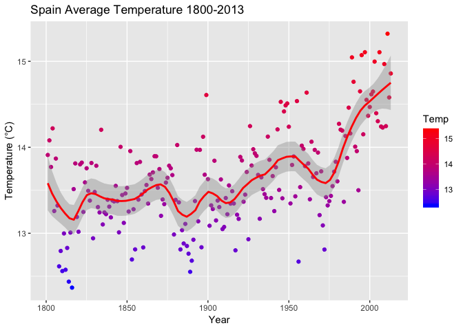
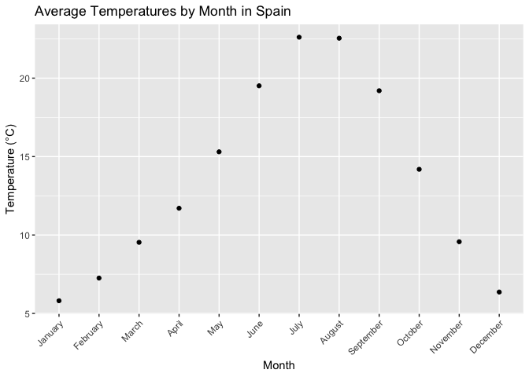
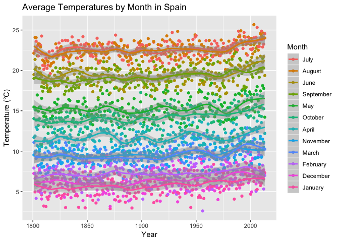
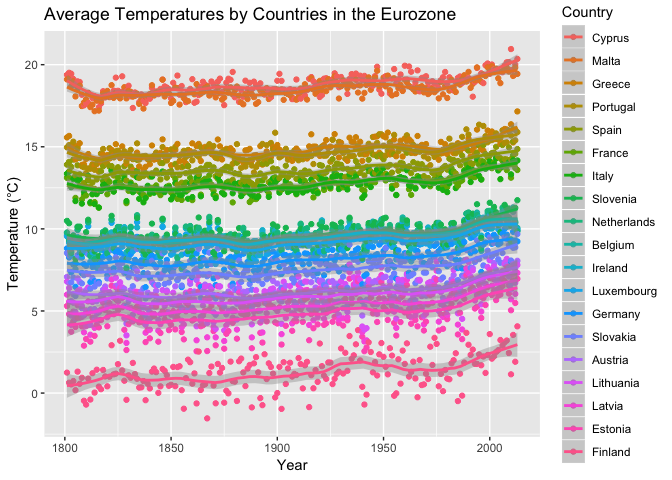
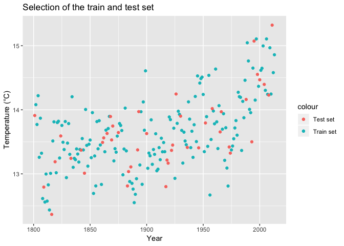
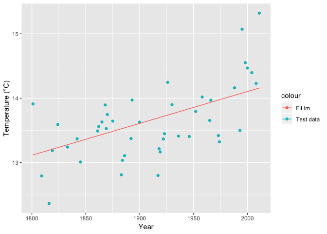
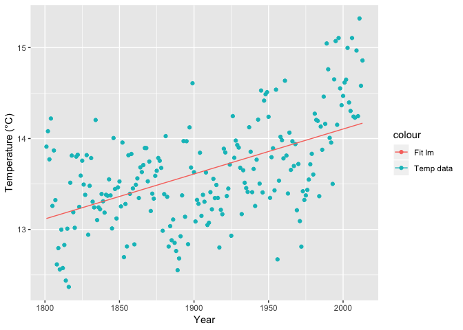
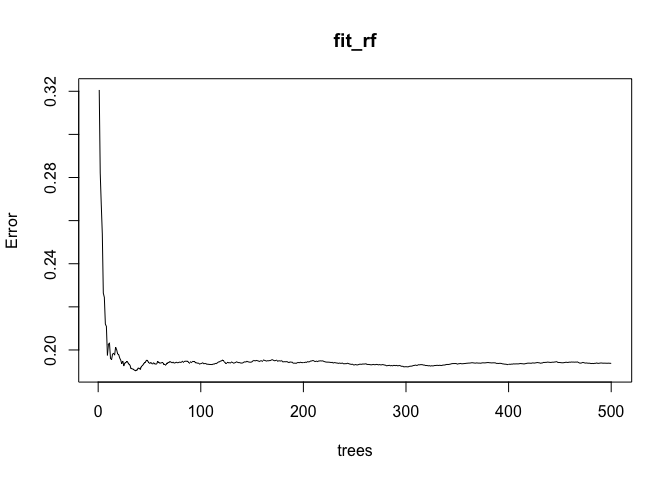
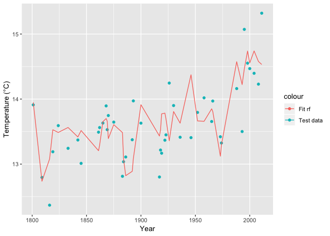
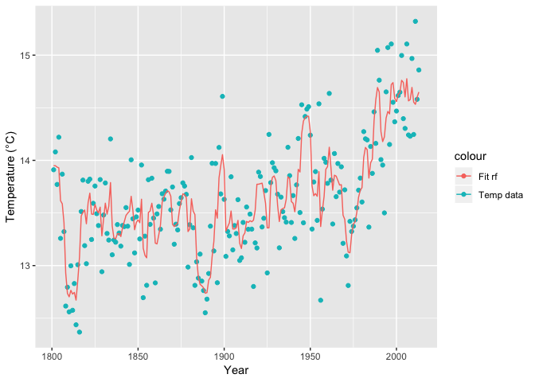

Temperature evolution Report
================
Lidia Almazan
16 June 2019

This work shows my first Capstone project thought and made by myself for the last course of the **HarvardX Data Science Professional Certificate** which is a series of career-oriented courses to develop in-demand skills of Data Science using the programming language R. 

I hope you enjoy reading it as much as I enjoyed doing it.

Introduction
============

Climate change is one of the biggest problems the society has to deal with and everyone, from the individual human to the governments have to take part to solve it or at least not to make it worst.

The present report shows the study and analysis of the temperature data compiled from Lawrence Berkeley National Laboratory and cleaned by Kaggle. The link is: <https://www.kaggle.com/berkeleyearth/climate-change-earth-surface-temperature-data>, where it is shown the average tempearture for more than 200 different countries from 1750 until 2013. We will focus on the Spanish data because is the country where I was born, but the same study could be done for all others.

The data used in the present work is uploaded in my github repository <https://github.com/lidia-almazan/temperature-evolution> and all the documents as the R script and the report can be also read or downloaded from there.

First of all we load the data from the corresponding csv file provided by Kaggle:

``` r
temp_country = read.csv("temperature-data/GlobalLandTemperaturesByCountry.csv")
```

We want to analyse and create a prediction of the average temperatures for the last 200 years in Spain. In the next sections, it will be shown the analysis of the data and how in the R script are implemented three different proposed models for the prediction of the average temperature comparing the RMSE obtained from each of them.

The libraries used in the present project are:

``` r
library(tidyverse)
library(caret)
library(ggplot2)
library(randomForest)
```

Analysis and Models
===================

Data Analysis
-------------

Before doing anything, we need to be familiar with the data and to know which information is provided. Therefore, we need to analyse the data loaded from the previous code line.

The `head function` give us the first rows of the loaded data:

``` r
head(temp_country)
```

    ##           dt AverageTemperature AverageTemperatureUncertainty Country
    ## 1 1743-11-01              4.384                         2.294   Åland
    ## 2 1743-12-01                 NA                            NA   Åland
    ## 3 1744-01-01                 NA                            NA   Åland
    ## 4 1744-02-01                 NA                            NA   Åland
    ## 5 1744-03-01                 NA                            NA   Åland
    ## 6 1744-04-01              1.530                         4.680   Åland

From it, we see the data contains 4 variables:

-   **dt**: date where the measure of the temperature was taken
-   **AverageTemperature**: global average temperature in celsius
-   **AverageTemperatureUncertainty**: 95% confidence interval around the average
-   **Country**: country of the measure

Using also the `summary function`:

``` r
summary(temp_country)
```

    ##           dt         AverageTemperature AverageTemperatureUncertainty
    ##  1950-02-01:   243   Min.   :-37.66     Min.   : 0.05                
    ##  1950-03-01:   243   1st Qu.: 10.03     1st Qu.: 0.32                
    ##  1950-04-01:   243   Median : 20.90     Median : 0.57                
    ##  1950-05-01:   243   Mean   : 17.19     Mean   : 1.02                
    ##  1950-06-01:   243   3rd Qu.: 25.81     3rd Qu.: 1.21                
    ##  1950-07-01:   243   Max.   : 38.84     Max.   :15.00                
    ##  (Other)   :576004   NA's   :32651      NA's   :31912                
    ##     Country      
    ##  Åland  :  3239  
    ##  Albania:  3239  
    ##  Andorra:  3239  
    ##  Austria:  3239  
    ##  Belarus:  3239  
    ##  Belgium:  3239  
    ##  (Other):558028

we see how the average temperature has a minimum of -37°C and a maximum of 38°C with a mean of 17°C. This information is computed for all the countries.

There is NA data which we don't want to disturb our analysis, therefore we get rid of it with:

``` r
temp_country <- temp_country %>% na.omit(temp_country)
```

In total we have the average temperature of many countries, we have exactly 242 countires:

``` r
n_distinct(temp_country$Country) 
```

    ## [1] 242

Now we focus on the data from Spain:

``` r
temp_country_spain <- temp_country %>% filter(Country=="Spain")
head(temp_country_spain)
```

    ##           dt AverageTemperature AverageTemperatureUncertainty Country
    ## 1 1743-11-01              9.346                         2.218   Spain
    ## 2 1744-04-01             13.567                         2.325   Spain
    ## 3 1744-05-01             14.274                         2.176   Spain
    ## 4 1744-06-01             19.288                         2.212   Spain
    ## 5 1744-07-01             22.056                         2.224   Spain
    ## 6 1744-09-01             18.131                         2.238   Spain

``` r
n_distinct(temp_country_spain)
```

    ## [1] 3166

``` r
summary(temp_country_spain)
```

    ##           dt       AverageTemperature AverageTemperatureUncertainty
    ##  1743-11-01:   1   Min.   : 1.719     Min.   :0.076                
    ##  1744-04-01:   1   1st Qu.: 8.252     1st Qu.:0.296                
    ##  1744-05-01:   1   Median :12.808     Median :0.712                
    ##  1744-06-01:   1   Mean   :13.613     Mean   :1.431                
    ##  1744-07-01:   1   3rd Qu.:19.296     3rd Qu.:2.202                
    ##  1744-09-01:   1   Max.   :26.033     Max.   :9.738                
    ##  (Other)   :3160                                                   
    ##         Country    
    ##  Spain      :3166  
    ##  Afghanistan:   0  
    ##  Africa     :   0  
    ##  Åland      :   0  
    ##  Albania    :   0  
    ##  Algeria    :   0  
    ##  (Other)    :   0

The data is from the first of November of 1743, and we have 3166 registered temperatures. In the case of Spain the minimum average temperature is 2°C and the maximum 26°C with a mean of 14°C.

We select only the data from 1800 until 2013 and we group it by year indepentdly of the month, averaging all the month of the same year.

``` r
temp_spain_year_1800_2013 <- temp_country_spain %>% 
  separate(col = dt, into = c("Year", "Month", "Day"), convert = TRUE) %>%
  filter(Year>1800) %>%
  group_by(Year) %>% 
  summarise(Temp = mean(AverageTemperature))
```

The resulting data is showed in the following plot using the method *loess* for a smooth fitting of the data.

``` r
qplot(Year,
      Temp,
      data=temp_spain_year_1800_2013,
      main="Spain Average Temperature 1800-2013",
      geom=c("point")) +
  geom_smooth(method =  "loess",color="red",  span = 0.15, method.args = list(degree=1)) +
  aes(colour = Temp) +
  scale_color_gradient(low="blue", high="red") +
  ylab("Temperature (°C)")
```



We can observe an increase in more than 1°C of the average temperature in the last 50 years.

Instead of selecting the data by years, we can also make the selection of the data averaged by month in the same range 1800-2013,

``` r
temp_spain_month <- temp_country_spain %>% 
  separate(col = dt, into = c("Year", "Month", "Day"), convert = TRUE) %>%
  filter(Year>1800) %>%
  group_by(Month) %>% 
  summarise(Temp = mean(AverageTemperature))
  
temp_spain_month$Month.Name <- with(temp_spain_month, month.name[Month])

ggplot(temp_spain_month, aes(x=Month.Name,y=Temp)) +
  theme(axis.text.x = element_text(angle =45, hjust = 1)) +
  geom_point() +
  labs(title="Average Temperatures by Month in Spain",
       x="Month",
       y="Temperature (°C)") +
  scale_x_discrete(limits=c("January", "February", "March", "April", "May", 
                            "June", "July", "August", "September", "October", 
                            "November", "December"))
```



We can clearly see that the coldest months of the year in Spain are in December and January and the hottest are in July and August. This plot is an average for the whole period of time. However, plotting the evolution of the average temperature by month for all the years, we observe that the temperature has a small scater and also there is an increasing tendence in the last 50 years.

``` r
temp_spain_month_1800_2013 <- temp_country_spain %>% 
  separate(col = dt, into = c("Year", "Month", "Day"), convert = TRUE) %>%
  filter(Year>1800) %>%
  group_by(Month)

temp_spain_month_1800_2013$Month.Name <- with(temp_spain_month_1800_2013, month.name[Month])

ggplot(temp_spain_month_1800_2013,
       aes(x=Year,y=AverageTemperature,colour=reorder(Month.Name, -AverageTemperature,mean)))+
  geom_point()+
  geom_smooth(method =  "loess", span = 0.15, method.args = list(degree=1)) +
  labs(title="Average Temperatures by Month in Spain",
       x="Year",
       y="Temperature (°C)",
       colour="Month")
```



We have also used the smoothing *loess* for the fitting. Each month is showed by different colors, and as we have said before, the coldest months are December and January, and the hottests are July and August.

In this project we focus in the average temperature of Spain, but it could be done a more deep study with many other countries. We will leave it for a future project. Nevertheless, we also want to show some data from the countries inside the eurozone, which are the following 19.

``` r
eurozone <- c("Austria","Belgium","Cyprus","Estonia","Finland","France","Germany",
              "Greece","Ireland","Italy","Latvia","Lithuania","Luxembourg","Malta",
              "Netherlands","Portugal","Slovakia","Slovenia","Spain")
```

We do the same selection as we did in the Spanish data, and we plot it over the countries:

``` r
temp_eurozone_year_1800_2013 <- temp_country %>% 
  filter(Country %in% eurozone) %>%
  separate(col = dt, into = c("Year", "Month", "Day"), convert = TRUE) %>%
  filter(Year>1800) %>%
  group_by(Year,Country) %>% summarise(Temp = mean(AverageTemperature))


ggplot(temp_eurozone_year_1800_2013,
       aes(x=Year,y=Temp,colour=reorder(Country, -Temp,mean)))+
  geom_point()+
  geom_smooth(method =  "loess", span = 0.15, method.args = list(degree=1)) +
  labs(title="Average Temperatures by Countries in the Eurozone",
       x="Year",
       y="Temperature (°C)",
       colour="Country")
```



In that case, there is a big difference between the coldest country and the hottest one, we are talking about 20°C. The coldest is Finland followed by Estonia, Latvia and Lithuania and the hottest are Cyprus and Malta.

Machine Learning models
-----------------------

There are many machine learning models, in the following chapter we will show three of them to make a prediction of the temperature in function of the year.

If we want to build a machine learning algorithm that predicts the average temperature of the country in function of the year, we have to generate testing and training sets:

``` r
set.seed(1)

y <- temp_spain_year_1800_2013$Temp
test_index <- createDataPartition(y, times = 1, p = 0.2, list = FALSE)

train_set <- temp_spain_year_1800_2013 %>% slice(-test_index)
test_set <- temp_spain_year_1800_2013 %>% slice(test_index)
```

The sets are generated from the cleaned data *temp\_spain\_year\_1800\_2013*. The training data set corresponds to the 80% of the data and the test set the 20% left. In the following plot it is shown in blue the train set and in red the test set.

``` r
ggplot() + 
  geom_point(data=train_set, aes(x=Year, y=Temp, colour = "Train set")) + 
  geom_point(data=test_set, aes(x=Year, y=Temp, colour = "Test set")) +
  labs(title="Selection of the train and test set",x="Year",y="Temperature (°C)")
```



### Model 1 - Mean

We start with a simple model which predict the same average temperarture for all years independently of the year we are interested with.

The average of all temperatures is:

``` r
mu_hat <- mean(train_set$Temp)
mu_hat
```

    ## [1] 13.63846

We compute the residual mean squared error (RMSE) to compare the different models, which is the typical error made while predicting the average temperature. The number give us the error in °C. In our basic model, the RMSE is 0.33°C.

``` r
model1_rmse <- mean((mu_hat - test_set$Temp)^2)

rmse_results <- data_frame(Model = "1 - Mean", RMSE = model1_rmse)
rmse_results %>% knitr::kable()
```

| Model    |       RMSE|
|:---------|----------:|
| 1 - Mean |  0.3331464|

### Model 2 - Linear regression

Linear regression can be considered a machine learning algorithm. This is a very simple method, but it has been observed that for some challenges it works rather well. It also serves as a baseline approach: if you can’t beat it with a more complex approach, you probably want to stick to linear regression.

In this method, the conditional expectation (what we want to estimate) is equivalent to the regression line:
*f*(*x*)=*β*<sub>0</sub> + *β*<sub>1</sub>*x*

We use the least squares as a method for estimating the slope *β*<sub>0</sub> and the intercept *β*<sub>1</sub>.

``` r
fit_lm <- lm(Temp ~ Year, data = train_set)
fit_lm
```

    ## 
    ## Call:
    ## lm(formula = Temp ~ Year, data = train_set)
    ## 
    ## Coefficients:
    ## (Intercept)         Year  
    ##    4.210292     0.004947

This give us an estimate of the conditional expectation.

We compute the RMSE using the fit obtained in the training set but in the test set.

``` r
y_hat_lm <- predict(fit_lm,test_set)

model2_rmse <- mean((y_hat_lm - test_set$Temp)^2)

rmse_results <- bind_rows(rmse_results,
                          data_frame(Model="2 - Least square",  
                                     RMSE = model2_rmse ))
rmse_results %>% knitr::kable()
```

| Model            |       RMSE|
|:-----------------|----------:|
| 1 - Mean         |  0.3331464|
| 2 - Least square |  0.2098278|

We can see that this does indeed provide an improvement over our previous guessing approach.

We plot the linear regression function with the test data:

``` r
ggplot(test_set, aes(Year)) + 
  geom_point(aes(y = test_set$Temp, colour = "Test data")) + 
  geom_line(aes(y = y_hat_lm, colour = "Fit lm")) +
  labs(x="Year",y="Temperature (°C)")
```



We can see the linear regression which has a positive slope of almost 1°C in the 200 years analysed.

Proceeding in the same way as in the previous plot, but now with the whole data:

``` r
temp_spain_year_1800_2013 %>%
  mutate(y_hat_lm = predict(fit_lm, newdata = temp_spain_year_1800_2013)) %>% 
  ggplot() +
  geom_point(aes(Year, Temp, colour = "Temp data")) +
  geom_line(aes(Year, y_hat_lm, colour = "Fit lm")) +
  labs(x="Year",y="Temperature (°C)")
```



We can see as previously, how the result is a linear regression increasing with the year, but the data we have is scatered. Therefore, we will try another model to see if our predictions can be improved.

### Model 3 - Random forest

Random forests are a very popular machine learning approach that addresses the shortcomings of decision trees using a clever idea. The goal is to improve prediction performance and reduce instability by averaging multiple decision trees (a forest of trees constructed with randomness).

The general idea is to generate many predictors, each using regression or classification trees, and then forming a final prediction based on the average prediction of all these trees. To assure that the individual trees are not the same, we use the bootstrap to induce randomness. The specific steps are as follows:

1.  Build decision trees using the training set. We refer to the fitted models as *T*<sub>1</sub>, *T*<sub>2</sub>, ..., *T*<sub>*B*</sub>
2.  For every observation in the test set, form a prediction $\\hat y\_j$ using tree *T*<sub>*j*</sub>
3.  At the end, form a final prediction with the average $\\hat y = \\frac{1}{B}\\sum\_{j=1}^B \\hat y\_j$

The model is implemented using the `randomForest function` provided by the **randomForest package**:

``` r
fit_rf <- randomForest(Temp ~ Year , data = train_set, importance = TRUE) 
fit_rf 
```

    ## 
    ## Call:
    ##  randomForest(formula = Temp ~ Year, data = train_set, importance = TRUE) 
    ##                Type of random forest: regression
    ##                      Number of trees: 500
    ## No. of variables tried at each split: 1
    ## 
    ##           Mean of squared residuals: 0.1937775
    ##                     % Var explained: 39.46

``` r
plot(fit_rf)
```



The last plot show us the error rate of the random forest model as a function of the number of trees. We can see that the accuracy improves as we add more trees until about 50 trees where accuracy stabilizes.

Using random forest model, we observe a reduction of the RMSE with respect to the linear regression,

``` r
y_hat_rf = predict(fit_rf, newdata = test_set)
# mean squared error for rf
model3_rmse <- mean((y_hat_rf - test_set$Temp)^2)
# saving the prediction in a data frame
rmse_results <- bind_rows(rmse_results,
                          data_frame(Model="3 - Random forest",  
                                     RMSE = model3_rmse ))
rmse_results %>% knitr::kable()
```

| Model             |       RMSE|
|:------------------|----------:|
| 1 - Mean          |  0.3331464|
| 2 - Least square  |  0.2098278|
| 3 - Random forest |  0.1843690|

The actual RMSE is 0.184°C.

We plot the random forest fit into the data test,

``` r
test_set %>%
  mutate(y_hat_rf) %>% 
  ggplot() +
  geom_point(aes(Year, Temp, colour = "Test data")) +
  geom_line(aes(Year, y_hat_rf, colour = "Fit rf")) +
  labs(x="Year",y="Temperature (°C)")
```



we see how in this model the fit is not linear anymore, and follows the data scattering.

The same is observed using the whole set of data,

``` r
temp_spain_year_1800_2013 %>%
  mutate(y_hat_rf = predict(fit_rf, newdata = temp_spain_year_1800_2013)) %>% 
  ggplot() +
  geom_point(aes(Year, Temp, colour = "Temp data")) +
  geom_line(aes(Year, y_hat_rf, colour = "Fit rf")) +
  labs(x="Year",y="Temperature (°C)")
```



Results
-------

In this project we have studied the average temperature data in Spain from 1800 until 2013. We used different machine learning models to find a good prediction of the average temperature in function of the year, and the RMSE obtained for each model are:

``` r
rmse_results %>% knitr::kable()
```

| Model             |       RMSE|
|:------------------|----------:|
| 1 - Mean          |  0.3331464|
| 2 - Least square  |  0.2098278|
| 3 - Random forest |  0.1843690|

with the lowest RMSE found in the random forest model.

Conclusions
-----------

The study of the climate change is more complex than just evaluating the average temperature of a country along the years. Would be more interesting the study of the gradient of temperature, because this would give us an idea of the extremes of the temperature. Also would be interesting a deeper analysis comparing many countries along the planet and different cities inside the same country.

However, there is a clear increase of 1°C in the average temperature in the last 200 years in Spain, and from the data analysis we have seen that the increase is stronger in the last 50 years. Of course, that could be influenced by many factors related with the climate change and we cannot conclude the reason but the fact.

The machine learning models used for predicting the temperature along the years give us an RMSE of 0.184°C using the random forest method, which is under my point of view a good error without having a big number of data points to train and test.
